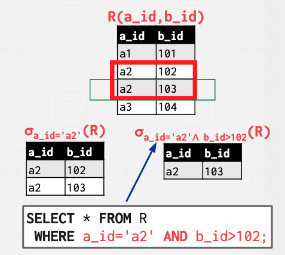

# Chapter 1 Course Intro && Relational Model

## COURSE OVERVIEW

This course is about the design/implementation of database management systems (DBMSs).

This is not a course about how to use a DBMS to build applications or how to administer a DBMS.

## DATABASE

1. Organized collection of inter-related data that models some aspect of the real-world.
2. Databases are the core component of most computer applications.

__Store our database as comma-separated value (CSV) files that we manage ourselves in our application code__

1. Use a separate file per entity
2. The application must parse the files each time they want to read/update records

## DATABASE MANAGEMENT SYSTEM

A __database management system (DBMS)__ is software that allows applications to store and analyze information in a database.

A __general-purpose DBMS__ supports the definition, creation, querying, update, and administration of databases in accordance with some data model.

## DATA MODELS

A __data model__ is a collection of concepts for describing the data in a database.

A __schema__ is a description of a particular collection of data, using a given data model.

## RELATIONAL MODEL

The relational model defines a _database abstraction_ based on relations to avoid maintenance overhead.

Key tenets

- Store database in _simple data structures_ (relations).
- _Physical storage_ left up to the DBMS implementation.
- _Access data through high-level language_, DBMS figures out best execution strategy.

Structure

>The definition of the database's relations and their contents.

Integrity

>Ensure the database's contents satisfy constraints.

Manipulation

>Programming interface for accessing and modifying a database's contents.

### CONCEPTS

__Relation__

A _relation_ is an unordered set that contain the relationship of attributes that represent entities.

__Tuple__

A _tuple_ is a set of attribute values (also known as its domain) in the relation.
- Values are (normally) atomic/scalar.
- The special value `NULL` is a member of every domain (if allowed).

__Primary Key__

A relation's primary key __uniquely identifies__ a single tuple.

Some DBMSs _automatically create an internal primary key_ if a table does not define one.

__Foreign Key__

A foreign key specifies that an attribute from _one relation_ has to map to _a tuple in another relation_.

## DATA MANIPULATION LANGUAGES (DML)

Methods to store and retrieve information from a database.

### Procedural

> 顺序查找，Relational Algebra (关系代数)

The query specifies the (high-level) strategy to find the desired result based on sets / bags.

### Non-Procedural (Declarative)

> 声明式查询，Relational Calculus (关系计算)

The query specifies only what data is wanted and not how to find it.

## RELATIONAL ALGEBRA

__Fundamental operations__ to retrieve and manipulate tuples in a relation (Based on set algebra).

Each operator takes one or more relations as its inputs and outputs a new relation.

We can "chain" operators together to create more complex operations.

### SELECT

Choose __a subset of the tuples__ from a relation that __satisfies a selection predicate__.

按条目进行选择

1. Predicate acts as a filter to retain only tuples that fulfill its qualifying requirement.
2. Can combine multiple predicates using conjunctions / disjunctions.

>Syntax: $σ_{predicate}(R)$

### PROJECTION

Generate a relation with tuples that contains __only the specified attributes__.

- rearrange attributes’ ordering.
- manipulate the values.

>Syntax: $\prod_{A1,A2,…,An}(R)$

### UNION

Generate a relation that contains all tuples that appear in __either only one or both input relations__.

>Syntax: (R ∪ S)

### INTERSECTION

Generate a relation that contains only the tuples that appear in __both of the input relations__.

>Syntax: (R ∩ S)

### DIFFERENCE

Generate a relation that contains only the tuples that __appear in the first and not the second of the input__ relations.

>Syntax: (R – S)

### PRODUCT

Generate a relation that contains all possible combinations of tuples from the input relations.

笛卡尔积

>Syntax: (R × S)

### JOIN

Generate a relation that contains all tuples that are a combination of two tuples (one from each input relation) with __a common value(s) for one or more attributes__.

>Syntax: (R ⋈ S)

## CONCLUSION

The relational model is independent of any __query__ language implementation.

关系模型独立于任何 __查询__ 语言的实现。

SQL is the ${de} {facto}$ standard (many dialects).

SQL 是事实上的标准（多种方言）。

Databases are __ubiquitous__.

数据库 __无处不在__ 。

Relational algebra defines the __primitives__ for processing queries on a relational database.

关系代数定义了处理关系数据库查询的 __原语__。

We will see relational algebra again when we talk about query optimization + execution.

当我们讨论查询优化+执行时，我们将再次看到关系代数。

