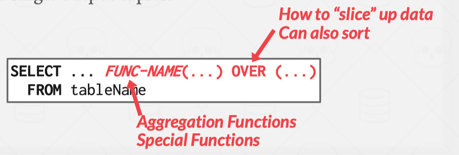
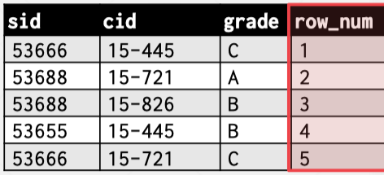

# Chapter 2 Modern SQL

## HISTORY

### STANDARD

Current standard is __SQL:2016__

- SQL:2016 → __JSON__, Polymorphic tables 
- SQL:2011 → Temporal DBs, Pipelined DML 
- SQL:2008 → Truncation, Fancy Sorting 
- SQL:2003 → XML, Windows, Sequences, Auto-Gen IDs. 
- SQL:1999 → Regex, Triggers, OO

### RELATIONAL LANGUAGES

- Data Manipulation Language (DML) 
- Data Definition Language (DDL)
- Data Control Language (DCL)

__SQL is based on bags (duplicates) not sets (no duplicates)__

SQL在处理数据时允许重复的行，而集合理论中的集合是不允许有重复元素的。

袋（Bag）：在SQL中，一个表中的行（记录）可以有重复的值。这意味着一个查询结果可以包含多条相同的记录。这种数据结构被称为“袋”，也叫“多重集合”（multiset）

例如，考虑以下表 employees：

|id|name|
|:---:|:---:|
|1|Alice|
|2|Bob|
|3|Alice|

在这个表中，name 列中有两个 "Alice"。

集合（Set）：在数学中的集合不允许有重复的元素。每个元素在集合中都是唯一的

### EXAMPLE DATABASE


## AGGREGATES

>集合体

Functions that return a single value from a bag of tuples:

- AVG(col)→ Return the average col value. 
- MIN(col)→ Return minimum col value. 
- MAX(col)→ Return maximum col value. 
- SUM(col)→ Return sum of values in col. 
- COUNT(col)→ Return # of values for col. 计算符合条件的行数

Aggregate functions can (almost) only be used in the SELECT output list.

Get # of students with a “@cs” login:

__COUNT() 函数__

1. COUNT(*)：计算表中所有的行数。
2. COUNT(column_name)：计算某一列中非 NULL 值的行数
3. COUNT(expression)：计算某个表达式非 NULL 结果的行数

```sql
SELECT COUNT(1+1+1) AS cnt FROM student WHERE login LIKE '%@cs'
```

you can refer to the graph above!

`SELECT COUNT(1+1+1) AS cnt`

- COUNT 函数的作用是计算符合条件的行数。COUNT 里面的表达式结果只要不是 NULL，对结果没有影响
- 换句话说，这句查询语句等价于 SELECT COUNT(*) AS cnt，即统计符合条件的行数
- AS cnt 给结果列一个别名为 cnt

`FROM student`

- 数据源表是 student

`WHERE login LIKE '%@cs'`

- WHERE 子句用于筛选 student 表中的行
- `login LIKE '%@cs'` 表示 login 列中的值必须以 @cs 结尾。__% 是一个通配符，表示任意数量的字符__

## MULTIPLE AGGREGATES

Get the number of students and their average GPA that have a “@cs” login.

```sql
SELECT AVG(gpa), COUNT(sid) AS num_students FROM student WHERE login LIKE '%@cs'
```

- `AVG(gpa)` 计算 gpa 列的平均值
- `COUNT(sid)` 计算 sid 列中非 NULL 值的行数
- `FROM student` 数据源表是 student

- `WHERE login LIKE '%@cs'` WHERE 子句筛选出 login 列以 @cs 结尾的行

|AVG(gpa)|COUNT(sid)|
|:---:|:---:|
|3.8|3|

## DISTINCT AGGREGATES

COUNT, SUM, AVG support DISTINCT, 即：这三者具备去重的潜质

`COUNT(DISTINCT col)` Return # of distinct values for col. 计算 col 列中不同值的行数

1. Get the number of unique students that have an “@cs” login.

```sql
SELECT COUNT(DISTINCT login) FROM student WHERE login LIKE '%@cs'
```

COUNT(DISTINCT login) 计算 login 列中满足条件的唯一值（去重后）的数量

|COUNT(DISTINCT login)|
|:---:|
|3|

2. 假设我们想要计算 login 列中以 @cs 结尾的唯一值的数量，可以这样写

```sql
SELECT COUNT(DISTINCT login) AS unique_login_count FROM student WHERE login LIKE '%@cs'
```

假设 student 表的数据如下：

| sid | name  | login     |
|-----|-------|-----------|
|  1  | Alice | alice@cs  |
|  2  | Bob   | bob@cs    |
|  3  | Carol | carol@math|
|  4  | Dave  | dave@cs   |
|  5  | Eve   | alice@cs  |

执行查询：

|unique_login_count|
|:---:|
|3|

## GROUP BY

Project tuples into subsets and calculate aggregates against each subset.


```sql
SELECT AVG(s.gpa), e.cid
    FROM enrolled AS e JOIN student AS s 
        ON e.sid = s.sid 
GROUP BY e.cid
```

- `enrolled AS e` enrolled 表起别名 e
- `student AS s` student 表起别名 s
- `FROM A JOIN B` 将 A表 与 B表 进行连接
- `ON C` 连接条件是C
- `GROUP BY e.cid` 按照课程ID (cid) 进行分组

通过将两个表连接起来，按照课程ID分组，计算每个课程的平均GPA

Non-aggregated values in SELECT output clause must appear in GROUP BY clause.

```sql
-- Wrong Case
SELECT AVG(s.gpa), e.cid, s.name
    FROM enrolled AS e, student AS s 
        WHERE e.sid = s.sid 
GROUP BY e.cid
```

```sql
-- Correct Case
SELECT AVG(s.gpa), e.cid, s.name
    FROM enrolled AS e JOIN student AS s 
        ON e.sid = s.sid 
GROUP BY e.cid, s.name
```

## HAVING

Filters results based on aggregation computation. Like a WHERE clause for a GROUP BY

场景：假设你想要计算每个课程的平均GPA，并筛选出平均GPA大于3.9的课程


```sql
SELECT AVG(s.gpa) AS avg_gpa, e.cid 
    FROM enrolled AS e, student AS s 
        WHERE e.sid = s.sid 
    GROUP BY e.cid 
HAVING AVG(s.gpa) > 3.9;
```

- `FROM enrolled AS e, student AS s WHERE e.sid = s.sid`
    - 使用 JOIN 将 enrolled 表和 student 表连接，条件是 e.sid = s.sid
- `SELECT AVG(s.gpa) AS avg_gpa` 
    - 选择每个课程的平均GPA，并给它起一个别名 avg_gpa
- `e.cid` 
    - 选择课程ID e.cid
- `GROUP BY e.cid` 
    - 按课程ID e.cid 进行分组，以便计算每个课程的平均GPA
- `HAVING AVG(s.gpa) > 3.9;` 
    - HAVING 子句用于筛选出平均GPA大于3.9的课程

PS:

```sql
FROM enrolled AS e, student AS s 
    WHERE e.sid = s.sid 
```

等价于

```sql
FROM enrolled AS e JOIN student AS s 
    ON e.sid = s.sid
```

## STRING OPERATIONS

LIKE is used for string matching.

### REGULAR EXPRESSIONS

- `%` matches any substring (including empty strings)
- `_` matches any single character

```sql
SELECT * FROM enrolled AS e 
    WHERE e.cid LIKE '15-%'
```

```sql
SELECT * FROM student AS s 
    WHERE s.login LIKE '%@c_'
```

### CONCATENATE

SQL standard says to use `||` operator to concatenate two or more strings together

```sql
-- SQL-92
SELECT name FROM student
    WHERE login = LOWER(name) || '@cs'
```

```sql
-- MSSQL
SELECT name FROM student
    WHERE login = LOWER(name) + '@cs'
```

```sql
-- MySQL
SELECT name FROM student
    WHERE login = CONCAT(LOWER(name), '@cs')
```

## OUTPUT REDIRECTION

Store query results in another table

- Table must not already be defined.
- Table will have the same # of columns with the same types as the input.

从 enrolled 表中选择唯一的 cid（课程ID），并将这些唯一的 cid 插入到一个名为 CourseIds 的新表中：

```sql
-- SQL-92
SELECT DISTINCT cid INTO CourseIds 
    FROM enrolled;
```

```sql
CREATE TABLE CourseIds (
    SELECT DISTINCT cid FROM enrolled
);
```

- `SELECT DISTINCT cid`:
    - 选择 enrolled 表中唯一的 cid 值。DISTINCT 关键字用于确保每个 cid 只出现一次（即去重）
- `INTO CourseIds`:
    - 将选择的结果插入到一个名为 CourseIds 的新表中。如果 CourseIds 表不存在，则会创建该表
- `FROM enrolled`:
    - 数据源表是 enrolled

假设 `enrolled` 表的数据如下：

| sid | cid  |
|-----|------|
|  1  | 101  |
|  2  | 101  |
|  3  | 102  |
|  4  | 102  |
|  5  | 103  |

执行这条语句后，新表 `CourseIds` 将会包含：

| cid  |
|------|
| 101  |
| 102  |
| 103  |

Insert tuples from query into another table:

1. Inner SELECT must generate the same columns as the target table. SELECT子句生成的列必须与目标表的列相匹配。
2. DBMSs have different options/syntax on what to do with integrity violations (e.g., invalid duplicates). 不同的数据库管理系统在处理数据完整性违规（如无效的重复项）时有不同的选项和语法。

__EXAMPLE 1__

假设我们有一个目标表target_table，它有两个列col1和col2。我们想要从另一个表source_table插入数据到target_table。

目标表结构：

```sql
CREATE TABLE target_table (
    col1 INT,
    col2 VARCHAR(50)
);
```

插入数据的正确SQL语句：

```sql
INSERT INTO target_table (col1, col2)
SELECT source_col1, source_col2
FROM source_table;
```

在这里，SELECT source_col1, source_col2生成的列与target_table中的列相匹配。

如果source_table中有额外的列或者列的顺序不匹配，就会引起错误。例如：

```sql
INSERT INTO target_table (col1, col2)
SELECT source_col1, source_col2, source_col3 -- 错误：列数不匹配
FROM source_table;
```

__EXAMPLE 2__

例如，假设我们有一个表users，其中username列必须是唯一的：

```sql
CREATE TABLE users (
    user_id INT PRIMARY KEY,
    username VARCHAR(50) UNIQUE
);
```

如果尝试插入一个已经存在的用户名，将会违反唯一性约束。

不同的DBMS有不同的选项和语法来处理这种情况：

这里以MySQL为例:

使用`INSERT IGNORE`忽略违反唯一性约束的行：

```sql
INSERT IGNORE INTO users (user_id, username) VALUES (1, 'alice');
```

使用`ON DUPLICATE KEY UPDATE`更新现有行：

```sql
INSERT INTO users (user_id, username) VALUES (1, 'alice')
    ON DUPLICATE KEY UPDATE username = 'alice';
```

## OUTPUT CONTROL

### ORDER

Format:

```sql
ORDER BY <column*> [ASC|DESC]
-- Order the output tuples by the values in one or more of their columns.
```

Example:

```sql
SELECT sid, grade FROM enrolled 
    WHERE cid = '15-721' 
ORDER BY grade
```

```sql
SELECT sid FROM enrolled
    WHERE cid = '15-721' 
ORDER BY grade DESC, sid ASC
```

### LIMIT

```sql
LIMIT <count> [offset]
```

- Limit the # of tuples returned in output. 
- Can set an offset to return a “range”

`LIMIT <count>`
- 功能：限制返回的行数。
- 用法：LIMIT <count>将查询结果限制为最多count行。

```sql
SELECT * FROM employees LIMIT 10;
```

这条语句将从employees表中返回前10行。

`OFFSET <offset>`
- 功能：跳过指定数量的行。
- 用法：OFFSET <offset>会跳过查询结果中的前offset行。

```sql
SELECT * FROM employees LIMIT 10 OFFSET 5;
```
这条语句将从employees表中返回从第6行开始的10行数据。

LIMIT子句用于限制返回结果的行数，OFFSET子句用于指定从结果中跳过的行数。

通过结合使用LIMIT和OFFSET，可以方便地获取查询结果中的特定“范围”数据。

Example:

假设我们有一个`employees`表，如下所示：

| id | name   | position  |
|----|--------|-----------|
|  1 | Alice  | Manager   |
|  2 | Bob    | Developer |
|  3 | Carol  | Designer  |
|  4 | Dave   | Developer |
|  5 | Eve    | Developer |
|  6 | Frank  | Designer  |
|  7 | Grace  | Manager   |
|  8 | Heidi  | Developer |
|  9 | Ivan   | Designer  |
| 10 | Judy   | Manager   |
| 11 | Mallory| Developer |
| 12 | Olivia | Designer  |

使用`LIMIT`和`OFFSET`来获取特定范围的数据，例如，我们想要获取第6到第10名的员工数据：

```sql
SELECT * FROM employees LIMIT 5 OFFSET 5;
```

返回的结果将是第6到第10名的员工数据：

| id | name   | position  |
|----|--------|-----------|
|  6 | Frank  | Designer  |
|  7 | Grace  | Manager   |
|  8 | Heidi  | Developer |
|  9 | Ivan   | Designer  |
| 10 | Judy   | Manager   |

## NESTED QUERIES

### HOW TO USE

Queries containing other queries.

They are often difficult to optimize.

Inner queries can appear (almost) anywhere in query.

__Format__


__Design__


__Example__

```sql
SELECT name FROM student
    WHERE sid IN ( 
        SELECT sid FROM enrolled 
            WHERE cid = '15-445' 
    )
```

这条SQL语句的作用是从`student`表中选取所有选修了课程编号为`15-445`的学生的名字。

```sql
SELECT sid FROM enrolled WHERE cid = '15-445'
```

- **作用**：从`enrolled`表中选择所有课程编号为`15-445`的学生ID (`sid`)。
- **结果**：返回所有选修了课程编号为`15-445`的学生ID列表。

```sql
SELECT name FROM student WHERE sid IN (...)
```

- **作用**：从`student`表中选择那些学生ID在内层子查询结果中的学生的名字。
- **`sid IN (...)`**：`IN`操作符用于检查`sid`是否在内层子查询返回的列表中。

这条语句先从`enrolled`表中找出所有选修了课程编号为`15-445`的学生ID，然后在`student`表中查找这些学生ID对应的学生名字。

假设我们有如下两个表：

`student` 表

| sid | name   |
|-----|--------|
| 1   | Alice  |
| 2   | Bob    |
| 3   | Carol  |
| 4   | Dave   |
| 5   | Eve    |

`enrolled` 表

| sid | cid    |
|-----|--------|
| 1   | 15-445 |
| 2   | 15-445 |
| 3   | 16-720 |
| 4   | 15-445 |
| 5   | 18-300 |

执行这条语句：

- **内层子查询**：`SELECT sid FROM enrolled WHERE cid = '15-445'` 返回 `sid` 为 1、2、4 的行。
- **外层查询**：从`student`表中选择`sid`为1、2、4的学生名字。

结果将是：

| name  |
|-------|
| Alice |
| Bob   |
| Dave  |

### CONDITIONAL NESTED QUERIES

- __ALL__ Must satisfy expression for _all rows_ in the sub-query.
- __ANY__ Must satisfy expression for _at least one row_ in the sub-query.
- __IN__ Equivalent to '=ANY()' .
- __EXISTS__ At least one row is returned without comparing it to an attribute in outer query.

1. Get the names of students in '15-445'

```sql
SELECT name FROM student
    WHERE sid = ANY( 
        SELECT sid FROM enrolled
            WHERE cid = '15-445'
    )
```

2. Find student record with the highest id that is enrolled in at least one course


3. Find all courses that have no students enrolled in it.


## WINDOW FUNCTIONS

Performs a "sliding" calculation across a set of tuples that are related.

Like an aggregation but tuples are not grouped into a single output tuples.

__Format__



__Example 1__

```sql
SELECT *, ROW_NUMBER() OVER () AS row_num 
    FROM enrolled
```



- `SELECT *` 
    - 选择enrolled表中的所有列
- `ROW_NUMBER() OVER ()`
    - ROW_NUMBER()是一个窗口函数，用于为查询结果集中的每一行分配一个唯一的行号
    - OVER ()：OVER子句定义了窗口函数的计算范围。在这里，__空的OVER ()子句__ 表示对 __整个结果集__ 应用ROW_NUMBER()函数

假设我们有一个enrolled表，如下所示：

|sid|cid|
|:---:|:---:|
|1|15-445|
|2|15-445|
|3|16-720|
|4|15-445|
|5|18-300|

执行这条SQL语句：

```sql
SELECT *, 
    ROW_NUMBER() OVER () AS row_num 
        FROM enrolled;
```

|sid|cid|row_num|
|:---:|:---:|:---:|
|1|15-445|1|
|2|15-445|2|
|3|16-720|3|
|4|15-445|4|
|5|18-300|5|

__Example 2__

The OVER keyword specifies how to group together tuples when computing the window function.

Use PARTITION BY to specify group.

```sql
SELECT cid, sid,
    ROW_NUMBER() OVER (PARTITION BY cid) AS row_num
        FROM enrolled 
    ORDER BY cid
```


`SELECT cid, sid`
- **作用**：选择`enrolled`表中的`cid`和`sid`列

`ROW_NUMBER() OVER (PARTITION BY cid)`
- **作用**：`ROW_NUMBER()`是一个窗口函数，用于为每个分组内的行分配一个唯一的行号
- **`PARTITION BY cid`**：`PARTITION BY`子句定义了分组依据，在这里是`cid` 也就是说，行号会在每个`cid`的分组内重新开始

`ORDER BY cid`
- **作用**：对结果集按照`cid`进行排序

假设我们有一个`enrolled`表，如下所示：

| sid | cid    |
|-----|--------|
| 1   | 15-445 |
| 2   | 15-445 |
| 3   | 16-720 |
| 4   | 15-445 |
| 5   | 18-300 |
| 6   | 16-720 |
| 7   | 18-300 |

执行这条SQL语句：

```sql
SELECT cid, sid, ROW_NUMBER() OVER (PARTITION BY cid) AS row_num FROM enrolled ORDER BY cid;
```

| cid    | sid | row_num |
|--------|-----|---------|
| 15-445 | 1   | 1       |
| 15-445 | 2   | 2       |
| 15-445 | 4   | 3       |
| 16-720 | 3   | 1       |
| 16-720 | 6   | 2       |
| 18-300 | 5   | 1       |
| 18-300 | 7   | 2       |

这条SQL语句从`enrolled`表中选取课程ID（`cid`）和学生ID（`sid`），并为每个课程中的每个学生分配一个行号。

行号在每个课程组（由`cid`分组）内从1开始递增，并且结果集按照`cid`进行排序。

`ROW_NUMBER() OVER (PARTITION BY cid)`函数用于生成分组内的行号。

__Example 3__

You can also include an ORDER BY in the window grouping to sort entries in each group.

```sql
SELECT *,
    ROW_NUMBER() OVER (ORDER BY cid)
            FROM enrolled
        ORDER BY cid
```

## COMMON TABLE EXPRESSIONS

Common Table Expression (CTE)

>CTE是一种可以在查询中 __临时定义__ 的结果集，主要用于使查询更具可读性和结构化。CTE通常在复杂查询中使用，可以像视图一样使用，但它仅在当前查询的范围内有效。

Provides a way to write auxiliary statements（辅助表述） for use in a larger query.

Alternative to nested queries and views.

```sql
WITH cteName AS ( 
    SELECT 1 
) 
SELECT * FROM cteName
```

```sql
WITH cteName (col1, col2) AS ( 
    SELECT 1, 2 
) 
SELECT col1 + col2 FROM cteName
```

You can bind/alias output columns to names before the AS keyword.

__Example 1__

Find student record with the highest id that is enrolled in at least one course.


__Example 2 (RECURSION)__

Print the sequence of numbers from 1 to 10.


