# Chapter 3 Database Storage

Review

- Homework #1
- Project #0

We now understand what a database looks like at a logical level and how to write queries to read/write data (e.g., using SQL).

We will next learn how to build software that manages a database (i.e., a DBMS).

1. Database is organized in pages. 
2. Different ways to track pages. 
3. Different ways to store pages. 
4. Different ways to store tuples.

## DISK-BASED ARCHITECTURE

The DBMS assumes that the primary storage location of the database is on non-volatile disk.

DBMS 假定数据库的主要存储位置位于非易失性磁盘上。

The DBMS's components manage the movement of data between non-volatile and volatile storage

DBMS 的组件管理非易失性和易失性存储之间的数据移动。

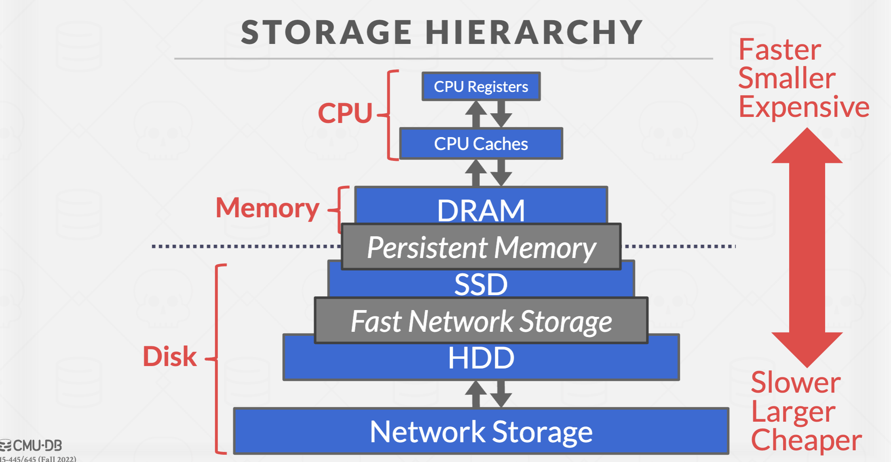

__Access Times__

>Latency numbers every programmer should know

- 1 ns L1 Cache Ref
- 4 ns L2 Cache Ref
- 100 ns DRAM
- 16,000 ns SSD
- 2,000,000 ns HDD
- 50,000,000 ns Network Storage

## SEQUENTIAL VS. RANDOM ACCESS

Towards non-volatile storage: SSD / HDD / Network Storage

Random access on non-volatile storage is almost always much __slower than sequential access__.

DBMS will want to maximize sequential access.

- Algorithms try to reduce number of writes to random pages so that data is stored in contiguous blocks.
- Allocating multiple pages at the same time is called an extent.

## SYSTEM DESIGN GOALS

1. Allow the DBMS to manage databases that exceed the amount of memory available.

- 允许 DBMS 管理超出可用内存量的数据库。

2. Reading/writing to disk is expensive, so it must be managed carefully to avoid large stalls and performance degradation.

- 读写磁盘的开销很大，因此必须谨慎管理，以避免出现大停顿和性能下降。

3. Random access on disk is usually much slower than sequential access, so the DBMS will want to maximize sequential access.

- 磁盘上的随机访问通常比顺序访问慢得多，因此 DBMS 希望最大化顺序访问。

## DISK-ORIENTED STORAGE

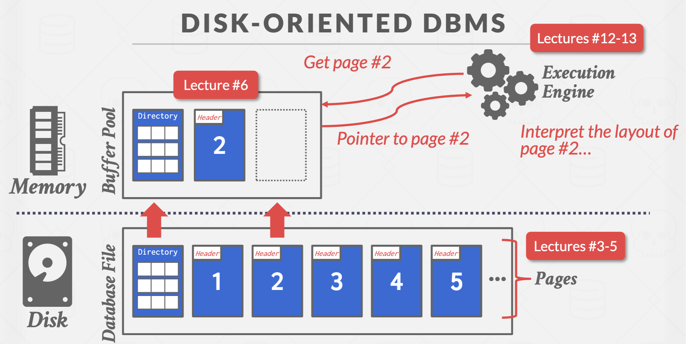

###  WHY NOT USE THE OS 

The DBMS can use memory mapping (mmap) to store the contents of a file into the address space of a program.

DBMS 可以使用内存映射 (mmap) 将文件的内容存储到程序的地址空间中。

The OS is responsible for moving the pages of the file in and out of memory, so the DBMS doesn’t need to worry about it.

操作系统负责将文件页面移入和移出内存，DBMS 不需要担心这个问题。

What if we allow multiple threads to access the mmap files to hide page fault stalls?

如果我们允许多个线程访问 mmap 文件以隐藏页面错误停顿会怎么样？

This works good enough for read-only access. It is complicated when there are multiple writers...

这对于只读访问来说还算可以。但当有多个写入器时，情况就变得复杂了...

DBMS (almost) always wants to control things itself and can do a better job than the OS.

- Flushing dirty pages to disk in the correct order. 按照正确的顺序将脏页刷新到磁盘
- Specialized prefetching. 专门的预取
- Buffer replacement policy. 缓冲区“替罪羊”选取方法
- Thread/process scheduling. 线程规划

The OS is not your friend in db.

ref: [paper](https://db.cs.cmu.edu/mmap-cidr2022/)

## DATABASE STORAGE

There are 2 main problems:

- How the DBMS represents the database in files on disk?

- How the DBMS manages its memory and moves data back-and-forth from disk?

### FILE STORAGE

The DBMS stores a database as one or more files on disk typically in a proprietary format.

DBMS 通常以专有格式将数据库作为一个或多个文件存储在磁盘上。

The OS doesn't know anything about the contents of these files. 

操作系统对这些文件的内容一无所知。

Early systems in the 1980s used custom filesystems on raw storage.

早在20 世纪 80 年代的早期系统，就已经在原始存储上使用自定义文件系统。

Some "enterprise" DBMSs still support this. Most newer DBMSs do not do this.

一些 “企业” DBMS 仍然支持这一点。大多数较新的 DBMS 不这样做。

### STORAGE MANAGER

The storage manager is responsible for maintaining a database's files

- Some do their own scheduling for reads and writes to improve spatial and temporal locality of pages

It organizes the files as a collection of pages

- Tracks data read (down) / written to pages (up)
- Tracks the available space

PS: spatial and temporal locality 空间和时间局部性

### DATABASE PAGES

A page is a fixed-size block of data.

- It can contain tuples, meta-data, indexes, log records...
- Most systems do not mix page types.
- Some systems require a page to be self-contained.

Each page is given a unique identifier.

- The DBMS uses an indirection layer to map page IDs to physical locations.

There are three different notions of "pages" in a DBMS:

- Hardware Page (usually 4KB)
- OS Page (usually 4KB)
- Database Page (512B-16KB)

A hardware page is the largest block of data that the storage device can guarantee failsafe writes

硬件页面是存储设备可以保证故障安全写入的最大数据块

### PAGE STORAGE ARCHITECTURE

Different DBMSs manage pages in files on disk in different ways.

- __Heap File__ Organization
- Tree File Organization
- Sequential / Sorted File Organization (ISAM)
- Hashing File Organization

At this point in the hierarchy we don't need to know anything about what is inside of the pages.

We don't konw anything inside the pages. It's just about how to find Page 1,2,3,4... based on someone's request up above.

__HEAP FILE__

A heap file is an _unordered_ collection of pages with tuples that are _stored in random order_.

- Create / Get / Write / Delete Page
- Must also support iterating over all pages

1. It is easy to find pages if there is only a single file. (offset and index is enough for this)
2. Need meta-data to keep track of _what pages exist in_ multiple files and which ones have free space

__HEAP FILE: PAGE DIRECTORY__

The DBMS maintains special pages that tracks the location of data pages in the database files

- Must make sure that the directory pages are in sync with the data pages

The directory also records meta-data about available space

- The number of free slots per page
- List of free / empty pages

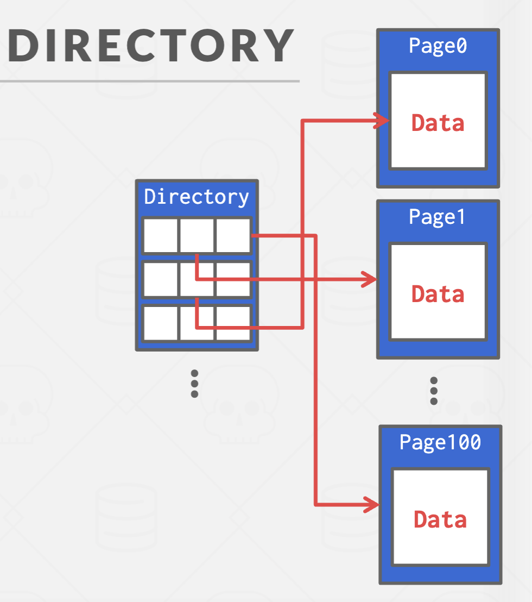

## PAGE LAYOUT

### PAGE HEADER

Every page contains a header of meta-data about the page's contents.

- Page Size
- Checksum
- DBMS Version
- Transaction Visibility
- Compression Information

Some systems require pages to be self-contained (e.g., Oracle)

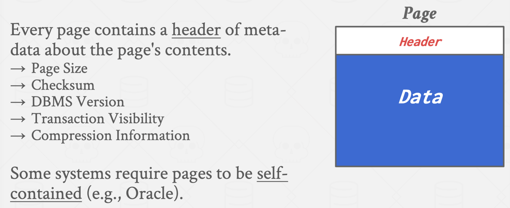

For any page storage architecture, we now need to decide how to organize the data inside of the page(Data Part in a page above).

We are still assuming that we are only storing tuples.

Two approaches:

- Tuple-oriented (today)
- Log-structured (next class)

### TUPLE STORAGE

__Strawman Idea__

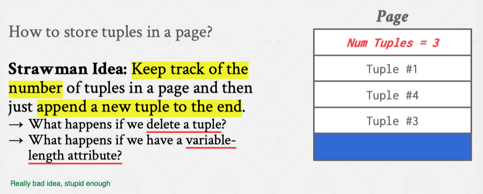

__Slotted Pages__

The most common layout scheme is called slotted pages.

The slot array maps "slots" to the tuples' starting position offsets.

The header keeps track of:

- The # of used slots 
- The offset of the starting location of the last slot used

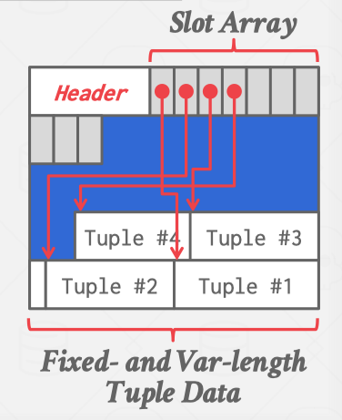 

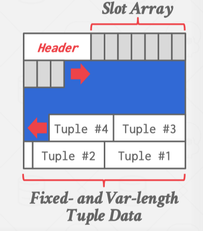

__Record IDs__

The DBMS needs a way to keep track of individual tuples.

Each tuple identifier is assigned a unique record

- Most common: page_id + offset/slot 
- Can also contain file location info

## TUPLE LAYOUT

A tuple is essentially a sequence of bytes.

It's the job of the DBMS to interpret those bytes into attribute types and values.

### TUPLE HEADER

Each tuple is prefixed with a __header__ that contains __meta-data__ about it.

- Visibility info (concurrency control) 
- Bit Map for NULL values.

We do not need to store meta-data about the schema.

### TUPLE DATA

Attributes are typically stored in the order that you specify them when you create the table.

This is done for software engineering reasons (i.e., simplicity).

However, it might be more efficient to lay them out differently.

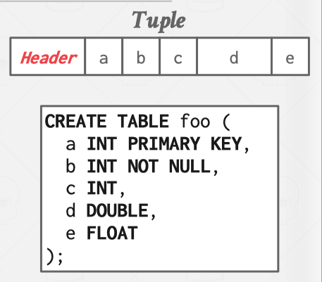

### DENORMALIZED TUPLE DATA

__Pointer__

DBMS can physically __denormalize__ (e.g., "pre join") related tuples and store them together in the same page.

- Potentially reduces the amount of I/O for common workload patterns.
- Can make updates more expensive.

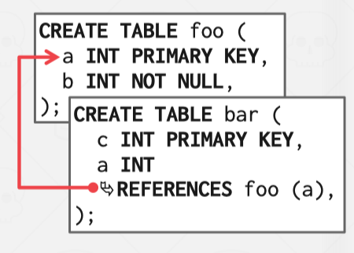

__Denormalized Tuple__

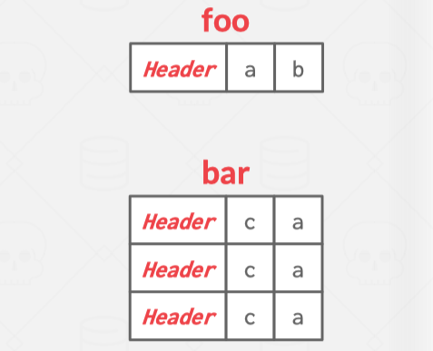

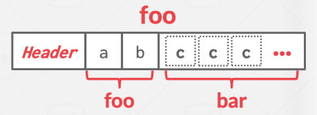

