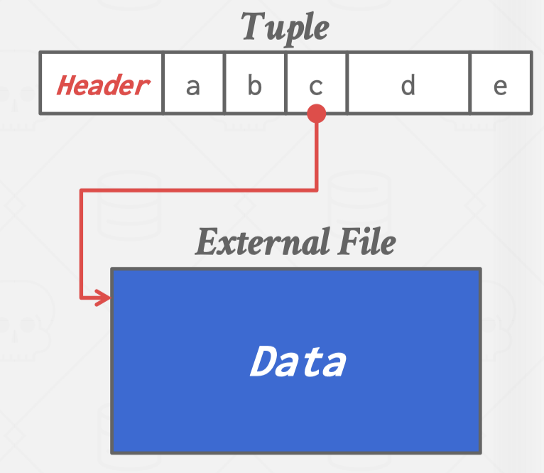

# Chapter 4 Database Storage

???+ note "Disk-Oriented Storage"
    - The DBMS assumes that the primary storage location of the database is on non-volatile disk
    - The DBMS's components manage the movement of data between non-volatile and volatile storage

???+ note "Page-Oriented Storage"
    Insert a new tuple:
        - Check page directory to find __a page with a free slot__.
        - Retrieve the page __from disk__ (if not in memory).
        - Check slot array to __find empty space__ in page that will fit.
    Update an existing tuple using its record id:
        - Check page directory to __find location of page__.
        - Retrieve the page from disk (if not in memory).
        - Find __offset in page__ using slot array.
        - __Overwrite__ existing data (if new data fits).

What are some potential problems with the slotted page design?

- Fragmentation→Useless Disk I/O
- Random Disk I/O (e.g., update 20 tuples on 20 pages)

What if the DBMS could not overwrite data in pages and could only create new pages?

- Examples: Cloud storage (S3), HDFS6

## LOG-STRUCTURED STORAGE

### LOG - STRUCTURE

DBMS stores log records that contain changes to tuples (PUT, DELETE).

- Each _log record_ must contain the tuple's _unique identifier_.
- __Put__ records contain the __tuple contents__.
- __Deletes__ marks the tuple as __deleted__.

As the application makes changes to the database, the DBMS appends log records to the end of the file _without checking previous log records_.

We just use the newest one in a in-memory file.


### WRITE-IN AND RETRIEVE BACK

When the page gets full, the DBMS writes it out disk and starts filling up the next page with records.

- All disk writes are sequential. 
- On-disk pages are immutable (不可移动的).

### INDEX

To read a tuple with a given id, the DBMS finds the __newest log record corresponding to that id__.

- Scan log from newest to oldest.

Maintain an __index__ that __maps__ a _tuple id_ to the _newest log record_.

- If log record is in-memory, just read it. 
- If log record is on a disk page, retrieve it. 
- We will discuss indexes in two weeks.


### LOG - STRUCTURED COMPACTION

The log will grow forever. The DBMS needs to periodically compact (压缩) pages to reduce wasted space.


After a page is compacted, the DBMS does need to maintain temporal ordering of records within the page

- Each tuple id is guaranteed to appear at most once in the page

The DBMS can instead sort the page based on id order to improve efficiency of future look-ups

- Called Sorted String Tables (SSTables)


Compaction coalesces larger log files into smaller files by removing unnecessary records.

压缩通过删除不必要的记录将较大的日志文件合并为较小的文件。


After merging SortedFile_1 with SortedFile_2, we get SortedFile_Merged, which is also sorted well.

### TUPLE STORAGE

A tuple is essentially a sequence of bytes.

It's the job of the DBMS to interpret those bytes into attribute types and values.

The DBMS's catalogs contain the schema information about tables that the system uses to figure out the tuple's layout.

## DATA REPRESENTATION

- INTEGER/BIGINT/SMALLINT/TINYINT
    - C/C++ Representation
- __FLOAT/REAL vs. NUMERIC/DECIMAL__
    - IEEE-754 Standard / Fixed-point Decimals
- VARCHAR/VARBINARY/TEXT/BLOB
    - Header with length, followed by data bytes.
    - Need to worry about collations / sorting.
- TIME/DATE/TIMESTAMP 
    - 32/64-bit integer of (micro)seconds since Unix epoch

### VARIABLE PRECISION NUMBERS

Inexact（不精确地）, variable-precision numeric type that uses the "native" C/C++ types.

Examples: FLOAT, REAL/DOUBLE

Store directly as specified by IEEE-754. 

Typically faster than arbitrary precision numbers but can have __rounding errors (舍入错误)__…


### FIXED PRECISION NUMBERS

Numeric data types with (potentially) arbitrary precision and scale. Used when rounding errors are unacceptable.

- Example: NUMERIC, DECIMAL

Many different implementations.

- Example: Store in an exact, variable-length binary representation with additional meta-data.

- Can be less expensive if you give up arbitrary precision.


### LARGE VALUES

Most DBMSs don't allow a tuple to exceed the size of a single page.

To store values that are larger than a page, the DBMS uses separate overflow storage pages.

- Postgres: TOAST (> 2KB) 
- MySQL: Overflow (> 1/2 size of page) 
- SQL Server: Overflow (> size of page)


### EXTERNAL VALUE STORAGE

Some systems allow you to _store a really large value_ in an __external file__. Treated as a `BLOB` type.

- Oracle: BFILE data type 
- Microsoft: FILESTREAM data type

The DBMS __cannot manipulate the contents of an external file__.

- No durability protections. 
- No transaction protections.



## SYSTEM CATALOGS

A DBMS stores meta-data about databases in its internal catalogs.

- Tables, columns, indexes, views 
- Users, permissions 
- Internal statistics

Almost every DBMS stores the database's catalog inside itself (i.e., as tables).

- Wrap object abstraction around tuples. 围绕元组包装对象抽象
- Specialized code for "bootstrapping" catalog tables. 设计专门代码“引导”目录表

You can query the DBMS’s internal __INFORMATION_SCHEMA__ catalog to get info about the database.

- ANSI standard set of read-only views that provide info about all the tables, views, columns, and procedures in a database.
- DBMSs also have non-standard shortcuts to retrieve this information.

### ACCESSING TABLE SCHEMA

List all the tables in the current database:

__Format (SQL92)__

```sql
SELECT *
    FROM INFORMATION_SCHEMA.TABLES
WHERE table_catalog = '<database_name>';
```

__Example__

```sql
SELECT *
    FROM INFORMATION_SCHEMA.TABLES
WHERE table_name = 'student';
```

